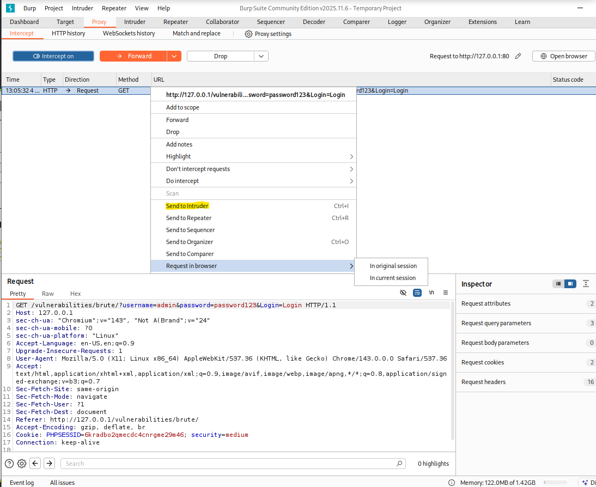
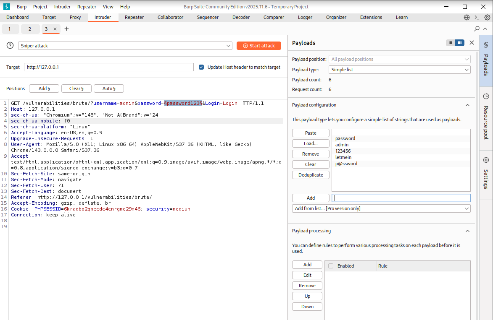
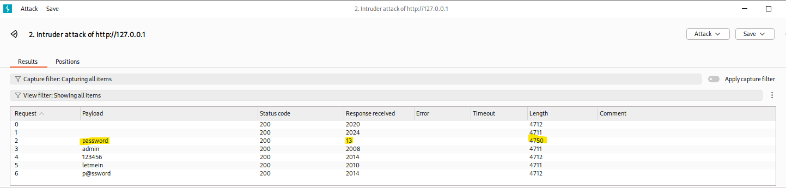
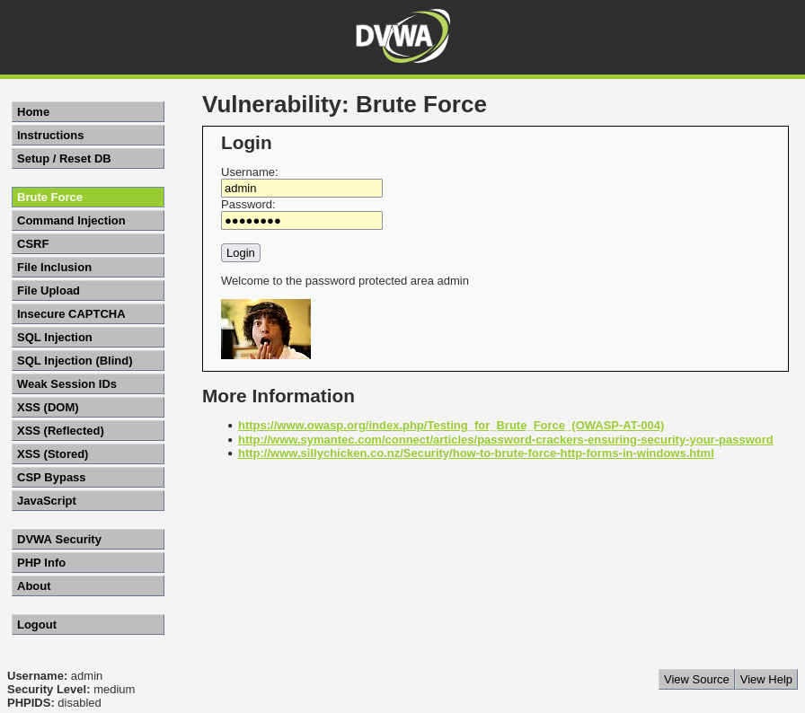

# Práctica 01: Brute Force (Nivel: Medium)

## 1. Descripción de la Vulnerabilidad
El ataque de **Fuerza Bruta** es un método de explotación que consiste en el envío masivo y automatizado de combinaciones de credenciales (usuario y contraseña) hasta encontrar una coincidencia válida. Es una vulnerabilidad crítica que permite el acceso no autorizado a cuentas si el sistema no implementa mecanismos de bloqueo o limitación de tasa (*rate limiting*).

---

## 2. Análisis del Nivel de Seguridad
En el nivel de dificultad **Medium**, el desarrollador ha implementado una medida de mitigación básica: una función de retraso (`sleep`) que se activa tras cada intento de inicio de sesión fallido.

> **⚠️ Debilidad del mecanismo:** Aunque esta medida ralentiza la velocidad del ataque, no impide la automatización. Al no existir un bloqueo real de la cuenta o de la dirección IP, un atacante con herramientas de intercepción puede identificar la contraseña correcta analizando las discrepancias en el tiempo de respuesta y la longitud del paquete devuelto por el servidor.

---

## 3. Metodología de Explotación
Para superar este reto, se utilizó la suite de herramientas profesional **Burp Suite Community Edition**. El proceso se dividió en las siguientes fases técnicas:

1. **Intercepción de Petición:** Se capturó la petición `GET` enviada al formulario de login en `/vulnerabilities/brute/` utilizando el proxy de Burp Suite.
2. **Configuración del Intruder:** Se envió la petición al módulo **Intruder**, seleccionando el modo de ataque **Sniper**.
3. **Definición de Payloads:** Se estableció el parámetro `password` como el único objetivo de la inyección y se cargó una lista de contraseñas comunes (diccionario de payloads).
4. **Ejecución y Monitoreo:** Se inició el ataque, supervisando las variaciones en las columnas de **Status**, **Length** y **Time**.

---

## 4. Análisis de Resultados (Evidencias)
El éxito de la explotación se confirmó de forma determinista mediante el análisis comparativo de las métricas de respuesta obtenidas en el Intruder:

* **Identificación por Longitud (Length):** Mientras que todos los intentos fallidos devolvieron una longitud de respuesta de **4711** o **4712**, la petición con el payload `password` (Request #2) devolvió una longitud anómala de **4750**.
* **Análisis de Tiempos (Time):** Debido al `sleep` implementado por el servidor, las respuestas incorrectas tardaron más de **2000ms**. El intento con las credenciales correctas respondió en apenas **13ms**, confirmando que el servidor validó los datos sin aplicar el retraso de seguridad.

### Credenciales Obtenidas
| Parámetro | Valor Identificado |
| :--- | :--- |
| **Username** | `admin` |
| **Password** | `password` |

---

## 5. Galería de Evidencias
A continuación se detallan las capturas de pantalla que documentan el proceso. *(Puedes encontrar las imágenes en esta misma carpeta)*:

**Captura 05: Interceptación de la petición original y envío al Intruder.**

**Captura 06: Configuración de las posiciones de los payloads y carga del diccionario.**

**Captura 07: Evidencia técnica clave. Tabla de resultados donde se aprecia la clara diferencia en Length y Response Time.**

**Captura 10: Confirmación visual en DVWA del acceso exitoso al área protegida.**

---

    
Desarrollado con ❤️ por <b>MaikelPlay</b>

    
    
    

