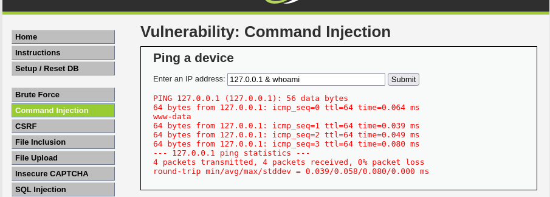
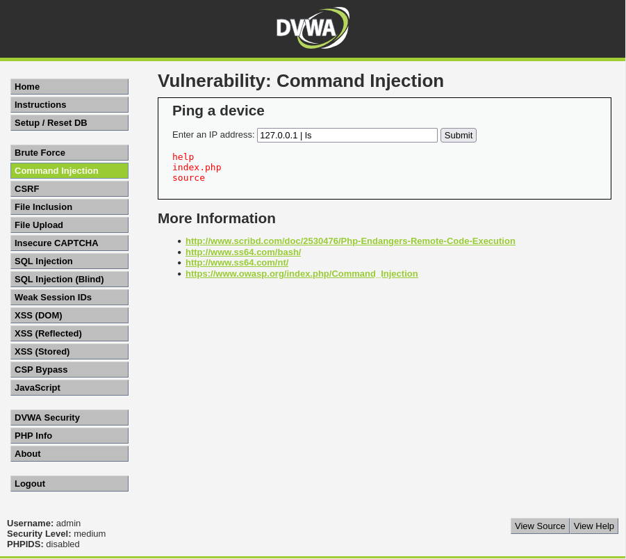

# Práctica 02: Command Injection (Nivel: Medium)

## 1. Descripción de la Vulnerabilidad
La **Inyección de Comandos** (Command Injection) es una vulnerabilidad crítica que ocurre cuando una aplicación web pasa datos proporcionados por el usuario directamente a una terminal o shell del sistema operativo sin una validación y sanitización adecuadas. Esto permite a un atacante ejecutar comandos arbitrarios con los privilegios del servidor web, pudiendo comprometer por completo el sistema.

---

## 2. Análisis del Nivel de Seguridad
En el nivel **Medium**, la aplicación intenta protegerse contra la inyección de comandos implementando un filtro de listas negras (*blacklist*). El código del backend (PHP) busca y elimina específicamente los operadores de concatenación más comunes como el punto y coma (`;`) y el AND lógico (`&&`).

> **⚠️ Debilidad del mecanismo:** El enfoque de listas negras suele ser ineficaz. Al prohibir solo caracteres específicos, el desarrollador ha olvidado filtrar otros operadores válidos en sistemas Unix/Linux que permiten el encadenamiento de comandos, tales como el ampersand simple (`&`) o el operador de tubería o pipe (`|`).

---

## 3. Metodología de Explotación
Para eludir la protección del nivel medio, se utilizó la técnica de concatenación de comandos aprovechando los operadores permitidos por el filtro:

1. **Reconocimiento:** Se comprobó la funcionalidad legítima introduciendo una IP válida (`127.0.0.1`), la cual ejecuta un simple `ping`.
2. **Bypass del filtro:** Al estar bloqueados el `;` y el `&&`, se optó por inyectar comandos usando los operadores `&` (ejecución en segundo plano/paralela) y `|` (pipe, que pasa la salida del primer comando al segundo).
3. **Payloads Inyectados:**
   * Para identificar al usuario del servidor: `127.0.0.1 & whoami`
   * Para listar los archivos del directorio actual: `127.0.0.1 | ls`

---

## 4. Análisis de Resultados (Evidencias)
La aplicación web procesó la entrada, no detectó coincidencias con su lista negra y envió la cadena completa al sistema operativo, devolviendo el resultado por pantalla:

* **Ejecución de `whoami`:** El sistema devolvió la salida del ping seguida del resultado del comando inyectado, revelando que el servicio web se está ejecutando bajo el usuario `www-data`.
* **Ejecución de `ls`:** Utilizando el operador pipe (`|`), se logró listar los archivos del directorio del servidor, revelando la presencia de ficheros como `index.php` y la carpeta `source`.

### Comandos y Resultados
| Operador Usado | Comando Inyectado | Resultado |
| :---: | :--- | :--- |
| `&` | `whoami` | `www-data` |
| `\|` | `ls` | `help`, `index.php`, `source` |

---

## 5. Galería de Evidencias
A continuación se detallan las capturas de pantalla que documentan el proceso. *(Puedes encontrar las imágenes en esta misma carpeta)*:

**Captura 08: Bypass del filtro usando el ampersand simple (&) para inyectar "whoami".**

**Captura 11: Variación del ataque usando el operador pipe (|) para listar el directorio con "ls".**

---

    
Desarrollado con ❤️ por <b>MaikelPlay</b>

    
    
    
    

