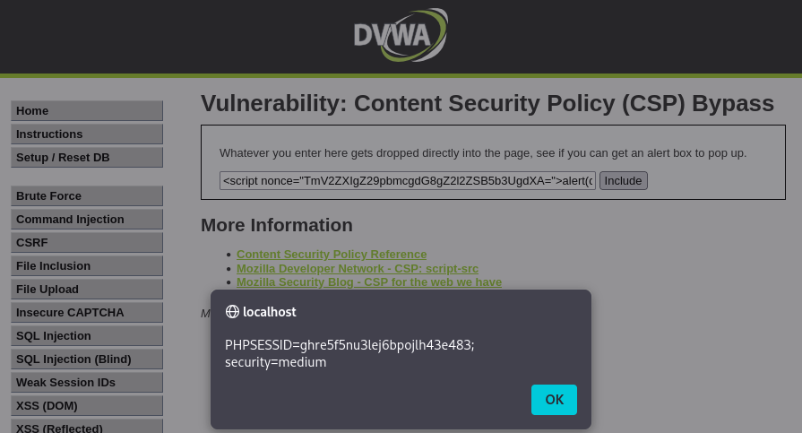
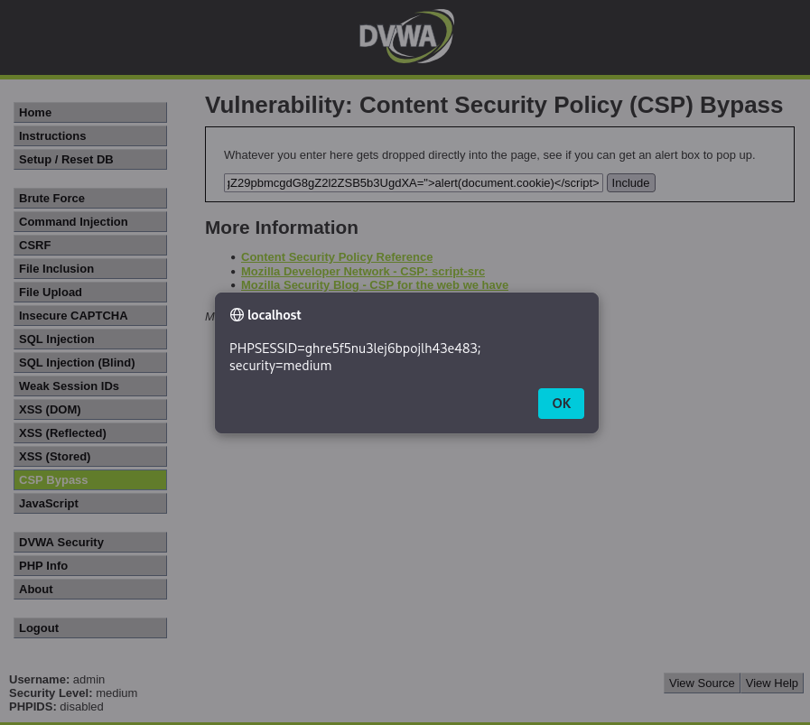

# Práctica 03: Content Security Policy (CSP) Bypass (Nivel: Medium)

## 1. Descripción de la Vulnerabilidad
La **Política de Seguridad de Contenido (CSP)** es una capa de seguridad adicional que ayuda a detectar y mitigar ciertos tipos de ataques, incluyendo Cross-Site Scripting (XSS) y ataques de inyección de datos. Un **CSP Bypass** ocurre cuando un atacante encuentra una falla o una mala configuración en estas reglas de seguridad, permitiéndole ejecutar código no autorizado (como JavaScript malicioso) a pesar de la existencia de la política restrictiva.

---

## 2. Análisis del Nivel de Seguridad
En el nivel **Medium**, la aplicación implementa una cabecera CSP que restringe la ejecución de scripts. Para permitir que funcionen ciertos scripts legítimos de la propia página, el desarrollador ha utilizado el atributo `nonce` (Number Used Once).

> **⚠️ Debilidad del mecanismo:** El propósito fundamental de un `nonce` es ser un valor criptográfico aleatorio y **único** por cada petición HTTP. Sin embargo, en esta implementación, el valor del nonce (`TmV2ZXIgZ29pbmcgdG8gZ2l2ZSB5b3UgdXA=`) es **estático** y está incrustado de forma fija en el código fuente. Al no cambiar nunca, pierde toda su efectividad y se convierte en una llave maestra reutilizable por cualquier atacante.

---

## 3. Metodología de Explotación
Para eludir la protección CSP de este nivel, se aprovechó la vulnerabilidad de la reutilización del *nonce* estático siguiendo estos pasos técnicos:

1. **Reconocimiento (Análisis del DOM):** Inspeccionando el código fuente de la página y las cabeceras de respuesta del servidor (F12 > Network), se identificó la política CSP activa y se extrajo el valor exacto del atributo `nonce` permitido.
2. **Creación del Payload:** Se construyó una etiqueta ``

---

## 4. Análisis de Resultados (Evidencias)
Al procesar la entrada modificada, el motor del navegador evaluó la etiqueta `<script>`. Como el atributo `nonce` inyectado coincidía exactamente con el valor autorizado en la cabecera CSP enviada por el servidor, el navegador interpretó que el script era seguro y legítimo.

* **Resultado:** La política de seguridad fue burlada (Bypass) con éxito, permitiendo la ejecución del código JavaScript `alert(document.cookie)`. Se logró visualizar en pantalla la cookie de sesión actual (`PHPSESSID`), demostrando la vulnerabilidad total a ataques XSS bajo esta mala configuración.

### Datos Clave del Bypass
| Elemento | Valor Identificado |
| :--- | :--- |
| **Cabecera Evadida** | `Content-Security-Policy: script-src 'nonce-...'` |
| **Nonce Estático** | `TmV2ZXIgZ29pbmcgdG8gZ2l2ZSB5b3UgdXA=` |

---

## 5. Galería de Evidencias
A continuación se detallan las capturas de pantalla que documentan el proceso. *(Puedes encontrar las imágenes en esta misma carpeta)*:

**Captura 09: Inyección del script incorporando el nonce estático extraído de la política del servidor.**

**Captura 12: Evidencia técnica de la ejecución. El navegador confía en el script al contener un nonce válido y ejecuta la alerta mostrando las cookies de sesión.**

---

    
Desarrollado con ❤️ por <b>MaikelPlay</b>

    
    
    
    

