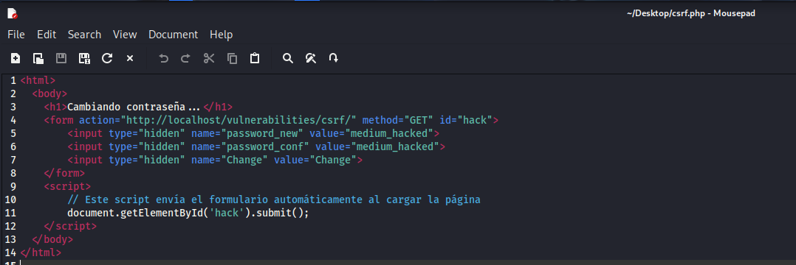
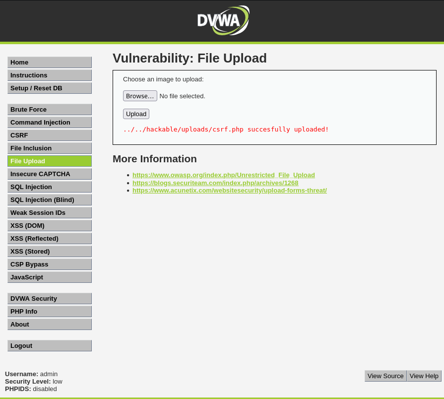
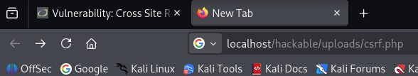
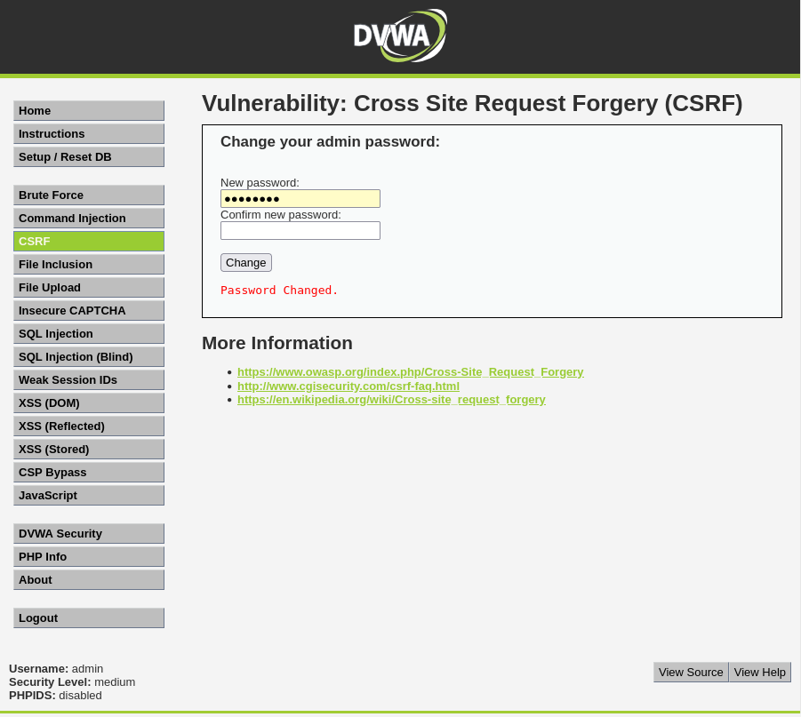

# Práctica 04: Cross-Site Request Forgery (CSRF) (Nivel: Medium)

## 1. Descripción de la Vulnerabilidad
El **Cross-Site Request Forgery (CSRF)** es un ataque que obliga a un usuario final autenticado a ejecutar acciones no deseadas en una aplicación web en la que actualmente confía. Aprovecha la sesión activa de la víctima para realizar operaciones críticas (como cambiar contraseñas, transferir fondos o modificar datos) sin su conocimiento ni consentimiento.

---

## 2. Análisis del Nivel de Seguridad
En el nivel **Medium**, el desarrollador ha implementado una validación basada en la cabecera HTTP `Referer`. El servidor comprueba que la petición de cambio de contraseña provenga estrictamente del propio servidor de DVWA (misma IP o dominio) y no de una página web externa controlada por el atacante.

> **⚠️ Debilidad del mecanismo:** Confiar exclusivamente en la cabecera `Referer` es un control de seguridad débil. Si un atacante logra alojar su script malicioso dentro del mismo servidor (aprovechando otra vulnerabilidad), la petición pasará la validación del origen y será ejecutada con éxito.

---

## 3. Metodología de Explotación
Para superar esta restricción, se diseñó un **Ataque Encadenado** (Chained Attack), combinando el objetivo de CSRF con una vulnerabilidad de **File Upload** (Subida de Archivos):

1. **Creación del Exploit:** Se programó un archivo llamado `csrf.php` con un formulario oculto que apunta a la URL de cambio de contraseña. Un script en JavaScript se encarga de enviar este formulario automáticamente al cargar la página (`document.getElementById('hack').submit();`).
2. **Infiltración (Bypass de Referer):** Se utilizó el módulo de *File Upload* de la aplicación para subir este archivo malicioso y alojarlo directamente en el servidor de DVWA.
3. **Ejecución:** Al acceder a la ruta interna donde se guardó el archivo (`/hackable/uploads/csrf.php`), el navegador ejecutó el código. Al originarse la petición desde el propio servidor local, la cabecera `Referer` enviada coincidió con la esperada por el filtro de seguridad.

---

## 4. Análisis de Resultados (Evidencias)
El ataque encadenado funcionó a la perfección. La validación del nivel medio confió en la petición porque reconoció que venía desde `localhost` (su propio entorno).

* **Resultado:** La contraseña del administrador fue cambiada exitosamente a `medium_hacked` de forma invisible e inmediata al cargar la URL maliciosa.

### Datos del Ataque
| Elemento | Valor |
| :--- | :--- |
| **Nueva Contraseña** | `medium_hacked` |
| **Ruta del Exploit** | `http://localhost/hackable/uploads/csrf.php` |

---

## 5. Galería de Evidencias
A continuación se detallan las capturas de pantalla que documentan el proceso. *(Puedes encontrar las imágenes en esta misma carpeta)*:

**Captura 16: Código fuente del exploit diseñado para enviar el formulario automáticamente.**

**Captura 14: Subida exitosa del archivo malicioso utilizando el módulo File Upload.**

**Captura 15: Acceso directo a la ruta del archivo alojado en el servidor para ejecutar el ataque.**

**Captura 13: Evidencia técnica del éxito. Mensaje del servidor confirmando el cambio de contraseña.**

---

    
Desarrollado con ❤️ por <b>MaikelPlay</b>

    
    
    
    

