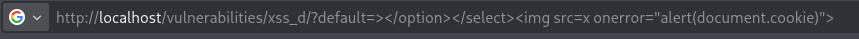
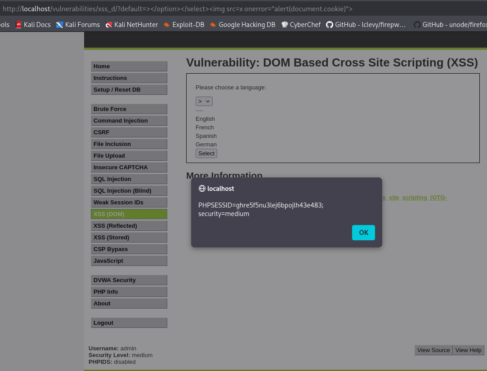

-red?style=for-the-badge)

# Práctica 05: DOM Based Cross Site Scripting (XSS) (Nivel: Medium)

## 1. Descripción de la Vulnerabilidad
El **Cross-Site Scripting basado en DOM (DOM XSS)** es una variante de XSS donde la vulnerabilidad reside íntegramente en el lado del cliente (en el código JavaScript que se ejecuta en el navegador). Ocurre cuando la aplicación web recoge un dato suministrado por el usuario (por ejemplo, desde la URL) y lo utiliza para actualizar o modificar dinámicamente el Modelo de Objetos del Documento (DOM) sin la debida sanitización.

---

## 2. Análisis del Nivel de Seguridad
En el nivel **Medium**, el desarrollador ha intentado añadir protección en el lado del servidor, probablemente buscando interceptar etiquetas `<script>` en el parámetro `default` que se pasa por la URL para seleccionar el idioma. 

> **⚠️ Debilidad del mecanismo:** El problema es que el código JavaScript de la página coge ese parámetro directamente de la URL y lo inyecta dentro de un menú desplegable (`<select>...</select>`). Si logramos "romper" esa estructura HTML cerrando las etiquetas prematuramente, podemos inyectar código HTML nuevo que el navegador renderizará como válido, evadiendo los filtros que solo buscan la etiqueta `<script>`.

---

## 3. Metodología de Explotación
Para este bypass, no necesitamos interceptar peticiones con Burp Suite; basta con manipular los parámetros GET directamente en la barra de direcciones del navegador:

1. **Reconocimiento del Contexto:** Al analizar el código fuente, se observa que el valor del parámetro `default` se imprime dentro de las etiquetas `<option>` de un menú de selección de idioma.
2. **Ruptura del Contexto HTML:** Para poder ejecutar código libremente, primero debemos cerrar las etiquetas existentes para "escapar" de ese menú desplegable.
3. **Inyección del Payload:** Se utiliza un vector de ataque basado en eventos (`onerror` de una etiqueta de imagen), el cual no utiliza la palabra restringida `<script>`.
   
   **Payload final introducido en la URL:**
   `></option></select>`

---

## 4. Análisis de Resultados (Evidencias)
Al procesar la URL manipulada, el código JavaScript de la víctima escribió nuestro payload literalmente en el DOM. El navegador interpretó la secuencia así:
1. Cerró la opción actual (`</option>`).
2. Cerró el menú desplegable (`</select>`).
3. Intentó cargar una imagen desde una fuente inexistente (`src=x`).
4. Al fallar la carga, se disparó el evento `onerror`, ejecutando nuestra función maliciosa.

* **Resultado:** Ejecución exitosa de JavaScript en el contexto del navegador, revelando las credenciales de sesión actuales (`PHPSESSID`) y confirmando la vulnerabilidad del DOM.

### Datos Clave de la Inyección
| Contexto Original | Payload de Escape e Inyección |
| :--- | :--- |
| `<select><option value="English">` | `></option></select>` |

---

## 5. Galería de Evidencias
A continuación se detallan las capturas de pantalla que documentan el proceso. *(Puedes encontrar las imágenes en esta misma carpeta)*:

**Captura 17: Manipulación del parámetro "default" directamente en la URL, inyectando el cierre de etiquetas y el payload de imagen.**

**Captura 18: Evidencia técnica de la ejecución. El DOM renderiza el código inyectado y dispara la alerta con la cookie de sesión.**

---

    
Desarrollado con ❤️ por <b>MaikelPlay</b>

    
    
    
    

