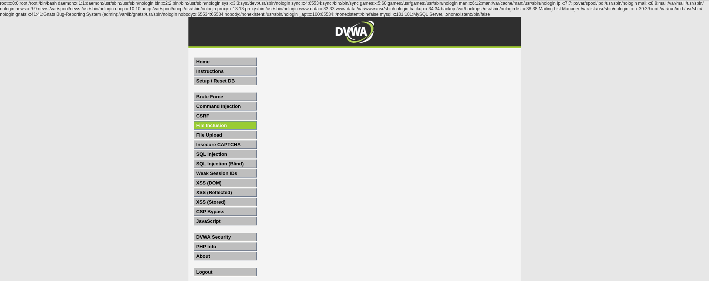

# Práctica 06: File Inclusion (Nivel: Medium)

## 1. Descripción de la Vulnerabilidad
La **Inclusión de Archivos** (File Inclusion) ocurre cuando una aplicación web permite al usuario controlar dinámicamente qué archivos se cargan y ejecutan en el servidor. Existen dos variantes: **LFI** (Local File Inclusion), que permite leer archivos locales de la máquina vulnerable; y **RFI** (Remote File Inclusion), que permite cargar archivos maliciosos desde un servidor externo controlado por el atacante.

---

## 2. Análisis del Nivel de Seguridad
En el nivel **Medium**, el desarrollador ha intentado mitigar los ataques de inclusión de archivos (tanto LFI como RFI) implementando una función de reemplazo de cadenas (como `str_replace` en PHP). El servidor busca y elimina automáticamente las secuencias de salto de directorio como `../` o `..\`, así como los prefijos `http://` y `https://`.

> **⚠️ Debilidad del mecanismo:** Eliminar las secuencias de salto de directorio (`../`) de forma simple no es suficiente. Los atacantes pueden eludir este filtro utilizando rutas absolutas directamente desde la raíz del sistema, o empleando técnicas de anidación (como `..././`) que, al ser procesadas por el filtro, se transforman en secuencias válidas.

---

## 3. Metodología de Explotación
Para eludir el filtro de salto de directorio del nivel medio y lograr un **Local File Inclusion (LFI)**, se siguió esta metodología:

1. **Reconocimiento:** Se identificó que la aplicación carga diferentes páginas a través del parámetro `page` en la URL (ej. `?page=include.php`).
2. **Prueba de Bypass:** Al intentar el clásico salto de directorios (`../../../../etc/passwd`), la aplicación falló porque el servidor eliminó los `../`.
3. **Inyección del Payload:** Se aprovechó la debilidad del filtro inyectando directamente la ruta absoluta del archivo objetivo desde el directorio raíz del sistema operativo Unix/Linux.

   **Payload inyectado en la URL:**
   `?page=/etc/passwd`

---

## 4. Análisis de Resultados (Evidencias)
El servidor web procesó el parámetro manipulado. Al no contener la cadena `../`, el filtro de seguridad lo dejó pasar intacto. Posteriormente, la función de inclusión de PHP (como `include()` o `require()`) cargó y mostró el contenido del archivo especificado en la respuesta HTTP.

* **Resultado:** Se logró visualizar el contenido completo del archivo `/etc/passwd` del servidor, exponiendo la lista de usuarios del sistema (como `root` o `www-data`), lo que demuestra una brecha crítica de confidencialidad e insulamiento de directorios.

### Datos Clave de la Extracción
| Parámetro Vulnerable | Archivo Extraído | Impacto |
| :--- | :--- | :--- |
| `page=` | `/etc/passwd` | Divulgación de información del sistema operativo |

---

## 5. Galería de Evidencias
A continuación se detallan las capturas de pantalla que documentan el proceso. *(Puedes encontrar las imágenes en esta misma carpeta)*:

**Captura 19: Evidencia técnica de la ejecución. Bypass del filtro mediante ruta absoluta y volcado en pantalla del archivo /etc/passwd.**

---

    
Desarrollado con ❤️ por <b>MaikelPlay</b>

    
    
    
    

