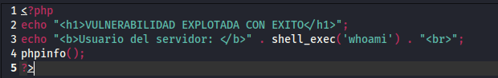
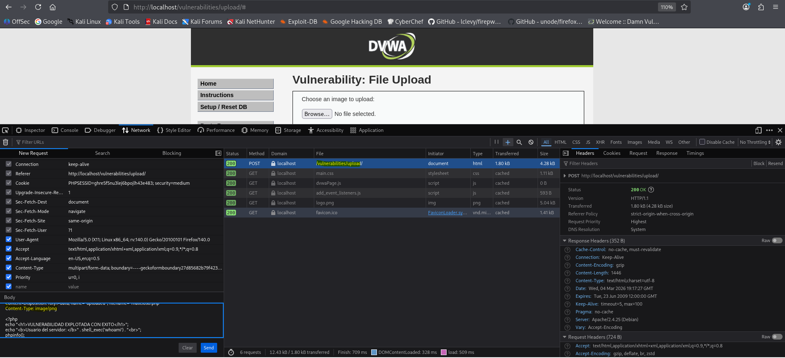
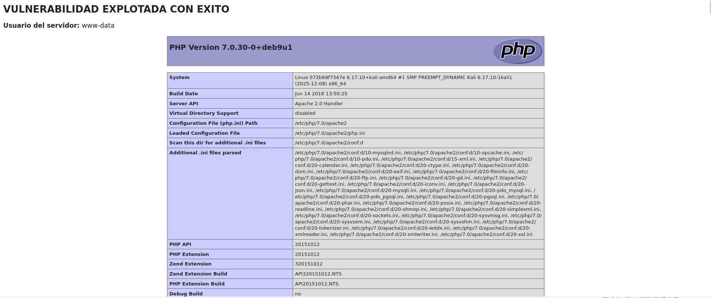

# Práctica 07: File Upload (Nivel: Medium)

## 1. Descripción de la Vulnerabilidad
La vulnerabilidad de **Subida de Archivos** (File Upload) ocurre cuando un servidor web permite a los usuarios subir archivos a su sistema de ficheros sin validar adecuadamente aspectos como el nombre, el tipo, el contenido o el tamaño. Si un atacante logra subir un script malicioso (como una *Web Shell* en PHP), puede llegar a tomar el control total del servidor comprometiendo su confidencialidad, integridad y disponibilidad.

---

## 2. Análisis del Nivel de Seguridad
En el nivel **Medium**, el desarrollador ha implementado una capa de seguridad para evitar la subida de archivos PHP. El backend verifica la cabecera HTTP `Content-Type` de la petición enviada por el navegador para asegurarse de que el archivo es estrictamente una imagen (comprueba que el tipo MIME sea `image/jpeg` o `image/png`) y evalúa el tamaño del archivo.

> **⚠️ Debilidad del mecanismo:** El mecanismo confía ciegamente en la cabecera `Content-Type`. Esta cabecera es generada por el navegador del cliente y, por lo tanto, puede ser fácilmente interceptada y manipulada por un atacante antes de que llegue al servidor, haciendo que un archivo `.php` se haga pasar por una imagen legítima.

---

## 3. Metodología de Explotación
Para superar este filtro, se utilizó **Burp Suite** con el objetivo de suplantar (spoofear) el tipo MIME del archivo malicioso durante su transmisión:

1. **Creación del Payload:** Se preparó un archivo con extensión `.php` que contiene código ejecutable.
2. **Intento de Subida e Intercepción:** Se seleccionó el archivo PHP en el formulario de la web y se activó el proxy de Burp Suite antes de pulsar el botón "Upload".
3. **Manipulación de Cabeceras (Bypass):** En la petición capturada, el navegador identificaba correctamente el archivo con el tipo `application/x-php` (o `application/octet-stream`). Se modificó manualmente ese valor por `image/jpeg` para engañar a la validación del servidor.
4. **Envío al Servidor:** Se liberó la petición modificada (`Forward`) permitiendo que llegara al backend.

---

## 4. Análisis de Resultados (Evidencias)
El servidor recibió el archivo `.php`, pero al leer la cabecera manipulada `Content-Type: image/jpeg`, la lógica de seguridad del nivel medio lo dio por válido y lo guardó en el sistema de ficheros.

* **Resultado:** El archivo fue subido exitosamente y el servidor nos devolvió la ruta exacta donde se almacenó (`../../hackable/uploads/`). A partir de este momento, acceder a esa ruta a través del navegador ejecutará nuestro código PHP.

### Datos del Bypass
| Elemento | Valor Original | Valor Manipulado (Bypass) |
| :--- | :--- | :--- |
| **Cabecera interceptada** | `Content-Type: application/x-php` | `Content-Type: image/jpeg` |
| **Ruta de subida** | - | `../../hackable/uploads/` |

---

## 5. Galería de Evidencias
A continuación se detallan las capturas de pantalla que documentan el proceso. *(Puedes encontrar las imágenes en esta misma carpeta)*:

**Captura 20: Preparación y selección del archivo PHP malicioso en el formulario de subida de DVWA.**

**Captura 21: Evidencia técnica clave. Interceptación con Burp Suite y modificación manual del parámetro Content-Type a "image/jpeg".**

**Captura 22: Confirmación visual del éxito. El servidor acepta el archivo y muestra la ruta de almacenamiento.**

---

    
Desarrollado con ❤️ por <b>MaikelPlay</b>

    
    
    
    

