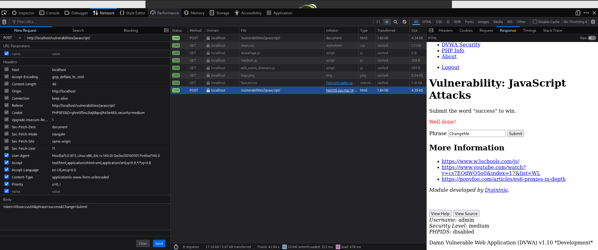

# Práctica 08: JavaScript Attacks (Nivel: Medium)

## 1. Descripción de la Vulnerabilidad
Los **Ataques de JavaScript** (Client-Side Logic Manipulation) ocurren cuando una aplicación confía en el código que se ejecuta en el navegador del usuario para realizar validaciones de seguridad, cálculos críticos o generación de tokens. Dado que el código del lado del cliente puede ser leído, pausado y modificado por el usuario, cualquier mecanismo de seguridad basado exclusivamente en JavaScript es inherentemente vulnerable a la ingeniería inversa y manipulación.

---

## 2. Análisis del Nivel de Seguridad
En el nivel **Medium**, el desarrollador ha intentado ofuscar y complicar la generación del token de validación que se envía al servidor. El script JavaScript original se encuentra en un archivo externo y utiliza una función para transformar una cadena de texto antes de asignarla al campo oculto `token` del formulario.

> **⚠️ Debilidad del mecanismo:** El servidor espera recibir un token específico para validar la petición. Sin embargo, al estar la lógica de generación escrita en el JavaScript del cliente, el atacante puede leer el código fuente, entender el algoritmo de transformación y generar el token válido manualmente (o forzar al navegador a hacerlo) antes de enviar la petición.

---

## 3. Metodología de Explotación
Para superar este reto, se realizó un proceso de análisis de código (Ingeniería Inversa) de la lógica del cliente:

1. **Reconocimiento (Code Review):** Inspeccionando el código fuente de la página y los archivos `.js` enlazados, se localizó la función encargada de generar el token.
2. **Análisis del Algoritmo:** Se descubrió que la función base toma la palabra `success`, invierte el orden de sus caracteres (quedando `sseccus`), y finalmente le concatena la cadena `XX` tanto al principio como al final.
3. **Generación del Payload:** Calculando la lógica descubierta, se dedujo que el token final válido y esperado por el backend debía ser obligatoriamente `XXsseccusXX`.
4. **Manipulación e Inyección:** Se interceptó la petición saliente (o se manipuló el DOM directamente mediante la consola de desarrollo) para inyectar la palabra "success" y reemplazar el token erróneo por el valor calculado `XXsseccusXX`.

---

## 4. Análisis de Resultados (Evidencias)
Al enviar la petición con el token calculado manualmente, el backend (PHP) comparó el valor recibido con el que él mismo esperaba validar. Al coincidir plenamente, el servidor procesó la solicitud como legítima.

* **Resultado:** El servidor aceptó la petición manipulada y devolvió el mensaje de éxito `Well done!`, confirmando que la lógica de validación basada en el cliente fue evadida por completo.

### Datos de la Ingeniería Inversa
| Entrada Original | Transformación (Lógica JS) | Token Final Inyectado |
| :--- | :--- | :--- |
| `success` | `Reverse` + Prefijo/Sufijo `XX` | `XXsseccusXX` |

---

## 5. Galería de Evidencias
A continuación se detallan las capturas de pantalla que documentan el proceso. *(Puedes encontrar las imágenes en esta misma carpeta)*:

**Captura 23: Evidencia técnica del éxito de la manipulación. Respuesta del servidor mostrando el mensaje "Well done!" tras validar el token "XXsseccusXX".**

---

    
Desarrollado con ❤️ por <b>MaikelPlay</b>

    
    
    
    

