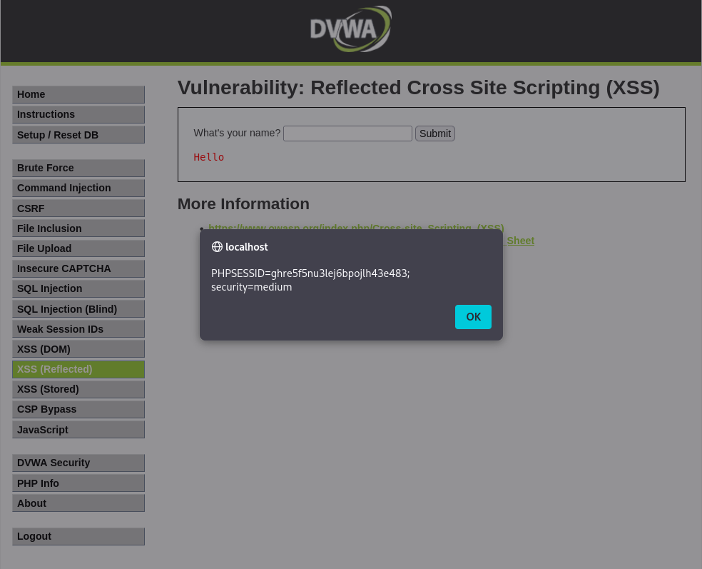

-red?style=for-the-badge)

# Práctica 09: Cross-Site Scripting Reflejado (XSS Reflected) (Nivel: Medium)

## 1. Descripción de la Vulnerabilidad
El **Cross-Site Scripting Reflejado (Reflected XSS)** ocurre cuando una aplicación web recibe datos de un usuario (generalmente a través de parámetros en la URL o un formulario) y los incluye inmediatamente en la respuesta HTTP (la página web) sin validarlos ni codificarlos (sanitizarlos) adecuadamente. Esto permite a un atacante inyectar código JavaScript malicioso que se ejecutará en el navegador de la víctima al hacer clic en un enlace manipulado.

---

## 2. Análisis del Nivel de Seguridad
En el nivel **Medium**, el desarrollador ha implementado una protección básica en el backend (PHP) utilizando la función `str_replace()`. El servidor busca específicamente la cadena exacta ``, se observó que el servidor eliminaba la etiqueta de apertura, dejando el código inservible.
3. **Bypass del Filtro:** Se aprovechó la vulnerabilidad de la función `str_replace()` manipulando el *casing* (mayúsculas/minúsculas) de las etiquetas para que el filtro no las reconociera, pero el navegador sí (ya que HTML no distingue entre mayúsculas y minúsculas).

   **Payload inyectado:**
   `` (o variaciones similares como `` |

---

## 5. Galería de Evidencias
A continuación se detallan las capturas de pantalla que documentan el proceso. *(Puedes encontrar las imágenes en esta misma carpeta)*:

**Captura 24: Evidencia técnica de la ejecución. El servidor refleja el payload evadiendo el filtro y el navegador dispara la alerta mostrando la cookie de sesión.**

---

    
Desarrollado con ❤️ por <b>MaikelPlay</b>

    
    
    
    

