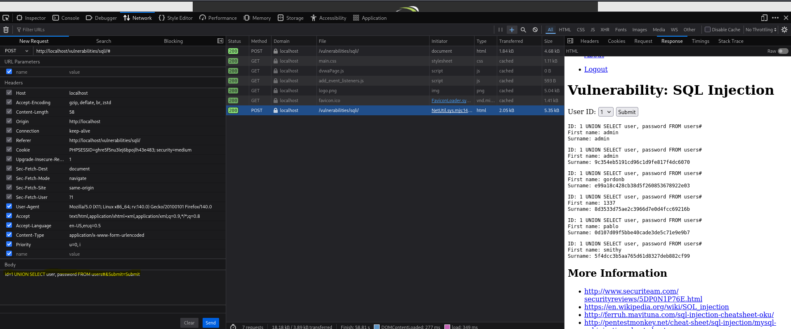

# Práctica 10: SQL Injection (SQLi) (Nivel: Medium)

## 1. Descripción de la Vulnerabilidad
La **Inyección SQL (SQLi)** es una vulnerabilidad crítica que permite a un atacante interferir en las consultas que una aplicación web realiza a su base de datos. Esto permite visualizar, modificar o eliminar datos que normalmente no estarían disponibles, como contraseñas, información de usuarios o datos confidenciales del negocio. En casos severos, puede derivar en la ejecución de comandos en el servidor subyacente.

---

## 2. Análisis del Nivel de Seguridad
En el nivel **Medium**, la aplicación intenta proteger la base de datos utilizando la función `mysqli_real_escape_string()`, la cual "escapa" caracteres especiales como comillas simples (`'`) o dobles (`"`) para evitar que rompan la consulta SQL. Además, la entrada se realiza a través de un menú desplegable (POST) en lugar de un parámetro GET en la URL.

> **⚠️ Debilidad del mecanismo:** El desarrollador cometió un error lógico grave: el parámetro `id` que recibe la consulta SQL espera un número entero (integer), por lo que **no está envuelto en comillas** dentro del código backend (`SELECT first_name, last_name FROM users WHERE user_id = $id`). Como no hay comillas que romper, la protección de escapar comillas es inútil. Podemos inyectar comandos SQL directamente.

---

## 3. Metodología de Explotación
Para eludir esta protección y extraer información sensible, se utilizó la técnica de inyección basada en **UNION** interceptando la petición POST:

1. **Intercepción:** Dado que la interfaz web solo ofrece un menú desplegable estricto, se utilizó Burp Suite (o el inspector del navegador) para capturar y modificar la petición POST enviada al servidor.
2. **Identificación de Columnas:** Mediante consultas `ORDER BY` o `UNION SELECT NULL, NULL`, se determinó que la consulta original devuelve exactamente 2 columnas.
3. **Inyección del Payload:** Al no necesitar comillas, se inyectó una instrucción `UNION` para concatenar los resultados de nuestra propia consulta maliciosa a los resultados de la consulta original. Se utilizó el símbolo `#` para comentar y anular cualquier resto de la consulta original.

   **Payload inyectado en el parámetro POST:**
   `1 UNION SELECT user, password FROM users#`

---

## 4. Análisis de Resultados (Evidencias)
La base de datos procesó la consulta manipulada. Primero ejecutó la búsqueda del ID 1 y, a continuación, ejecutó nuestro `UNION SELECT`, volcando todo el contenido de las columnas `user` y `password` de la tabla `users`.

* **Resultado:** La aplicación web renderizó en pantalla la base de datos completa de usuarios, revelando los nombres de usuario y los hashes (MD5) de sus contraseñas. Esto representa un compromiso total de la confidencialidad de las credenciales.

### Datos Clave de la Extracción
| Técnica Utilizada | Tabla Objetivo | Columnas Extraídas |
| :--- | :--- | :--- |
| `UNION Based SQLi` | `users` | `user`, `password` (Hashes) |

---

## 5. Galería de Evidencias
A continuación se detallan las capturas de pantalla que documentan el proceso. *(Puedes encontrar las imágenes en esta misma carpeta)*:

**Captura 25: Evidencia técnica de la ejecución. Volcado completo de la tabla de usuarios mostrando nombres de cuenta y hashes de contraseñas evadiendo el filtro del nivel medio.**

---

    
Desarrollado con ❤️ por <b>MaikelPlay</b>

    
    
    
    

