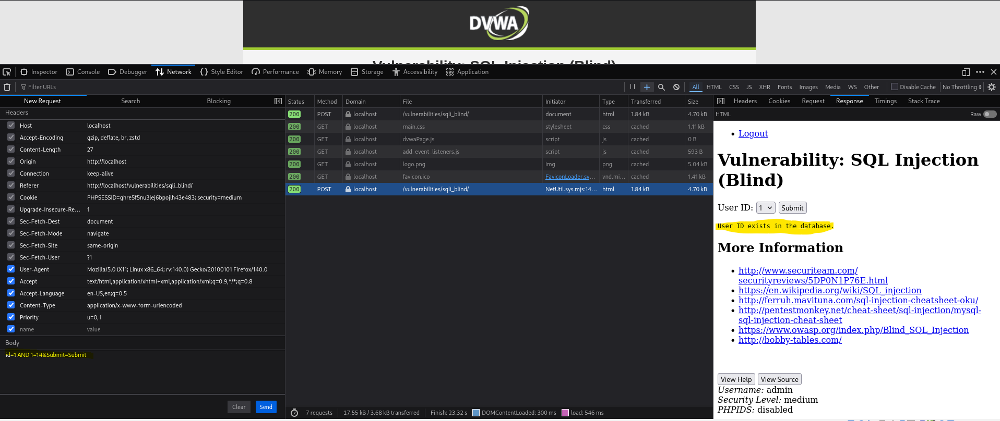

-red?style=for-the-badge)

# Práctica 11: SQL Injection Blind (Nivel: Medium)

## 1. Descripción de la Vulnerabilidad
La **Inyección SQL Ciega (Blind SQLi)** es una variante de la inyección SQL clásica. Ocurre cuando la aplicación web es vulnerable a la inyección, pero sus respuestas HTTP no contienen los resultados de la consulta a la base de datos ni los errores de sintaxis. El atacante debe reconstruir la base de datos letra por letra (o byte por byte) realizando preguntas lógicas al servidor y observando el comportamiento de la respuesta (basado en booleanos: Verdadero/Falso, o basado en tiempos: Time-Based).

---

## 2. Análisis del Nivel de Seguridad
Al igual que en la inyección SQL estándar de nivel **Medium**, la aplicación intenta protegerse utilizando `mysqli_real_escape_string()` y limitando la entrada a un menú desplegable (enviado por método POST). 

> **⚠️ Debilidad del mecanismo:** El fallo fundamental persiste: el parámetro `id` en el backend se trata como un número entero sin estar encapsulado entre comillas (`WHERE user_id = $id`). Esto significa que las funciones de escape de caracteres especiales son inútiles, permitiendo concatenar operadores lógicos directamente en la consulta.

---

## 3. Metodología de Explotación
Dado que el servidor no vuelca datos, se procedió a confirmar la vulnerabilidad mediante una **Inyección basada en Booleanos (Boolean-Based)**:

1. **Intercepción:** Se utilizó Burp Suite (o las herramientas de desarrollador del navegador) para capturar la petición POST generada por el menú desplegable.
2. **Planteamiento Lógico:** Se inyectaron operaciones matemáticas y lógicas para forzar a la base de datos a evaluar condiciones. Si la condición es cierta, la web devuelve un comportamiento (ej. "User exists"); si es falsa, devuelve otro (ej. "User is missing").
3. **Inyección de Payloads:**
   * Condición Verdadera: Se inyectó `1 AND 1=1#` (El ID 1 existe, Y 1 es igual a 1. Resultado: TRUE).
   * Condición Falsa: Se inyectaría `1 AND 1=2#` (El ID 1 existe, Y 1 es igual a 2. Resultado: FALSE).

---

## 4. Análisis de Resultados (Evidencias)
Al enviar el payload con la condición verdadera, el motor de la base de datos evaluó la expresión lógica `1=1` como afirmativa. Al procesar el resultado válido, la lógica de la aplicación web nos mostró el mensaje afirmativo por pantalla.

* **Resultado:** La aplicación respondió con `User ID exists in the database`. Este cambio de comportamiento basado en nuestra inyección matemática confirma al 100% que la aplicación es vulnerable a Blind SQLi. A partir de este punto, un atacante podría automatizar el proceso (con herramientas como SQLmap) para extraer la contraseña entera haciendo preguntas como *"¿La primera letra de la contraseña es la 'a'?"*.

### Datos Clave de la Inyección
| Tipo de Blind | Payload Lógico (Verdadero) | Reacción del Servidor |
| :--- | :--- | :--- |
| `Boolean-Based` | `1 AND 1=1#` | `User ID exists in the database` |

---

## 5. Galería de Evidencias
A continuación se detallan las capturas de pantalla que documentan el proceso. *(Puedes encontrar las imágenes en esta misma carpeta)*:

**Captura 26: Evidencia técnica de la ejecución. El servidor devuelve el mensaje lógico "User ID exists..." tras inyectar la condición verdadera (1 AND 1=1#) en la petición POST.**

---

    
Desarrollado con ❤️ por <b>MaikelPlay</b>

    
    
    
    

