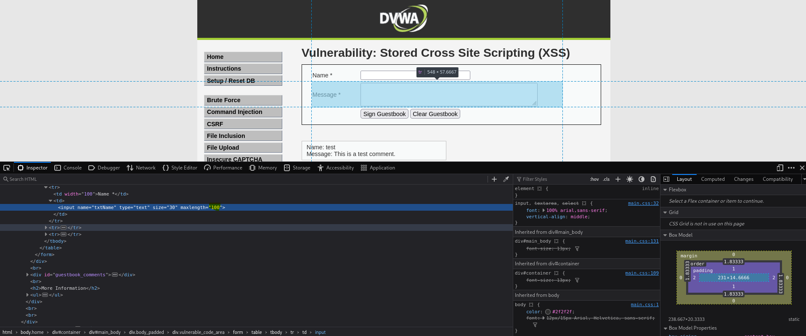
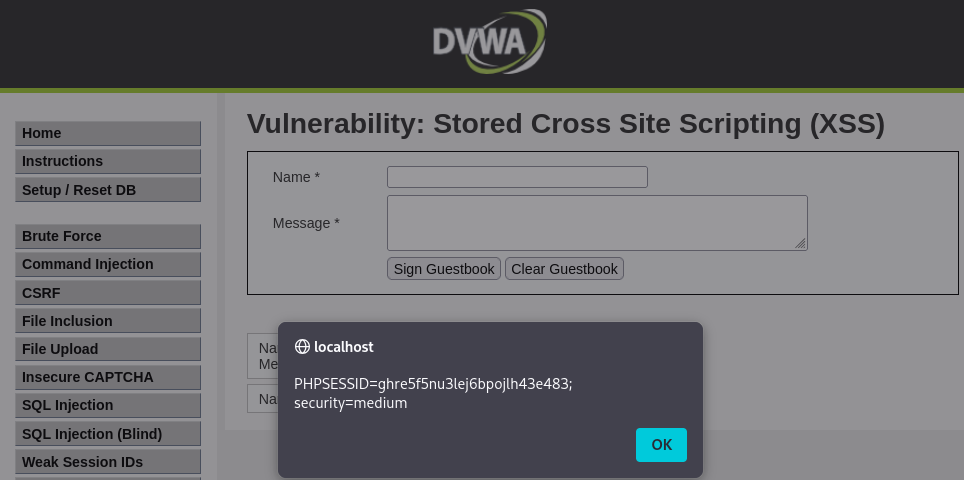

-red?style=for-the-badge)

# Práctica 12: Cross-Site Scripting Almacenado (XSS Stored) (Nivel: Medium)

## 1. Descripción de la Vulnerabilidad
El **Cross-Site Scripting Almacenado (Stored XSS)** o Persistente es la variante más crítica de XSS. Ocurre cuando una aplicación web recibe datos maliciosos de un atacante y los **guarda permanentemente** en su base de datos (por ejemplo, en un foro, un comentario de un blog o un libro de visitas). Posteriormente, cuando cualquier usuario legítimo (incluyendo administradores) visita la página afectada, el servidor le envía el código malicioso infectando su navegador automáticamente.

---

## 2. Análisis del Nivel de Seguridad
En el nivel **Medium**, el desarrollador ha implementado medidas de seguridad diferentes para los dos campos del formulario del libro de visitas (Guestbook):
* **Campo "Message":** Está protegido con funciones como `htmlspecialchars()` o `strip_tags()`, lo que impide inyectar código HTML/JS válido.
* **Campo "Name":** El backend utiliza `str_replace()` para eliminar la etiqueta exacta ``

---

## 4. Análisis de Resultados (Evidencias)
Al enviar el formulario, el servidor procesó el campo "Name". Como no encontró la coincidencia exacta `` |

---

## 5. Galería de Evidencias
A continuación se detallan las capturas de pantalla que documentan el proceso. *(Puedes encontrar las imágenes en esta misma carpeta)*:

**Captura 27: Inspección y modificación del DOM en vivo. Cambio del atributo maxlength para permitir la escritura del payload completo.**

**Captura 28: Evidencia técnica de la ejecución. El payload guardado en la base de datos se ejecuta persistentemente al cargar el Guestbook.**

---

    
Desarrollado con ❤️ por <b>MaikelPlay</b>

    
    
    
    

