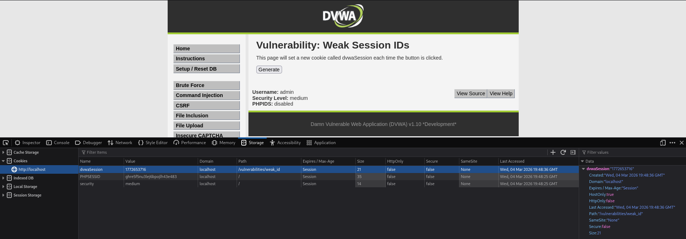
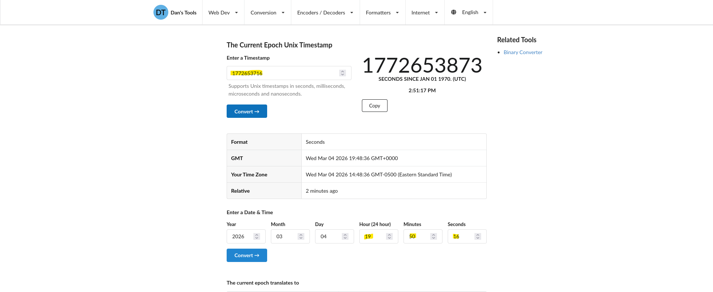

# Práctica 13: Weak Session IDs (Nivel: Medium)

## 1. Descripción de la Vulnerabilidad
La vulnerabilidad de **Identificadores de Sesión Débiles (Weak Session IDs)** ocurre cuando una aplicación web genera tokens de sesión (cookies) predecibles, secuenciales o basados en patrones conocidos. En lugar de utilizar valores criptográficamente seguros y verdaderamente aleatorios, el servidor asigna identificadores que un atacante puede adivinar, permitiéndole suplantar la identidad de otros usuarios activos (Session Hijacking) sin necesidad de conocer su usuario o contraseña.

---

## 2. Análisis del Nivel de Seguridad
En el nivel **Medium**, el desarrollador ha intentado hacer que el identificador de sesión parezca más complejo y menos secuencial que en el nivel bajo (donde simplemente sumaba +1). Para ello, ha decidido utilizar la función `time()` de PHP.

> **⚠️ Debilidad del mecanismo:** Utilizar la hora actual del servidor (formato Unix Timestamp o Epoch time) para generar una cookie es una práctica de seguridad desastrosa. El tiempo Unix es simplemente un contador de los segundos transcurridos desde el 1 de enero de 1970. Al no tener ningún componente de aleatoriedad (entropía), si un atacante conoce aproximadamente la hora a la que la víctima inició sesión, puede generar todas las cookies posibles de ese lapso de tiempo y probarlas hasta robar la cuenta.

---

## 3. Metodología de Explotación
Para demostrar la previsibilidad de la cookie generada, se realizó un proceso de análisis y decodificación:

1. **Generación de la Sesión:** Se interactuó con el botón de la aplicación para generar un nuevo valor para la cookie `dvwaSession`.
2. **Extracción (Inspección):** Utilizando las herramientas de desarrollador del navegador (DevTools > Storage/Almacenamiento), se inspeccionó el valor asignado a la cookie.
3. **Análisis del Patrón:** Se observó que el valor asignado era un número de 10 dígitos (ej. `1710000000`). Este formato es el estándar inconfundible del Tiempo Unix (Unix Epoch Time).
4. **Comprobación:** Para confirmar la hipótesis, se copió ese valor y se pegó en un conversor de Epoch online externo.

---

## 4. Análisis de Resultados (Evidencias)
Al convertir el valor numérico de la cookie en el conversor de tiempo, el resultado devolvió la fecha y hora exacta (con precisión de segundos) en la que se hizo clic en el botón de la aplicación.

* **Resultado:** Quedó demostrado de forma concluyente que la cookie no tiene ninguna seguridad criptográfica y es 100% predecible en base a la hora del sistema, dejando las sesiones de los usuarios totalmente expuestas a ataques de fuerza bruta sobre el rango de tiempo de su inicio de sesión.

### Datos del Análisis de la Cookie
| Nombre de la Cookie | Valor Generado | Algoritmo Descubierto |
| :--- | :--- | :--- |
| `dvwaSession` | Valor numérico de 10 dígitos | `Unix Timestamp (Epoch)` |

---

## 5. Galería de Evidencias
A continuación se detallan las capturas de pantalla que documentan el proceso. *(Puedes encontrar las imágenes en esta misma carpeta)*:

**Captura 29: Inspección del almacenamiento del navegador. Localización del valor numérico de la cookie dvwaSession.**

**Captura 30: Evidencia técnica de la vulnerabilidad. Conversión del valor de la cookie demostrando que equivale a la marca de tiempo (Timestamp) exacta.**

---

    
Desarrollado con ❤️ por <b>MaikelPlay</b>

    
    
    
    

